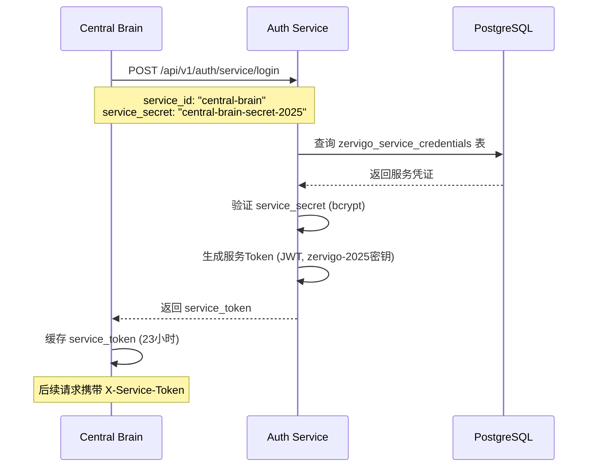
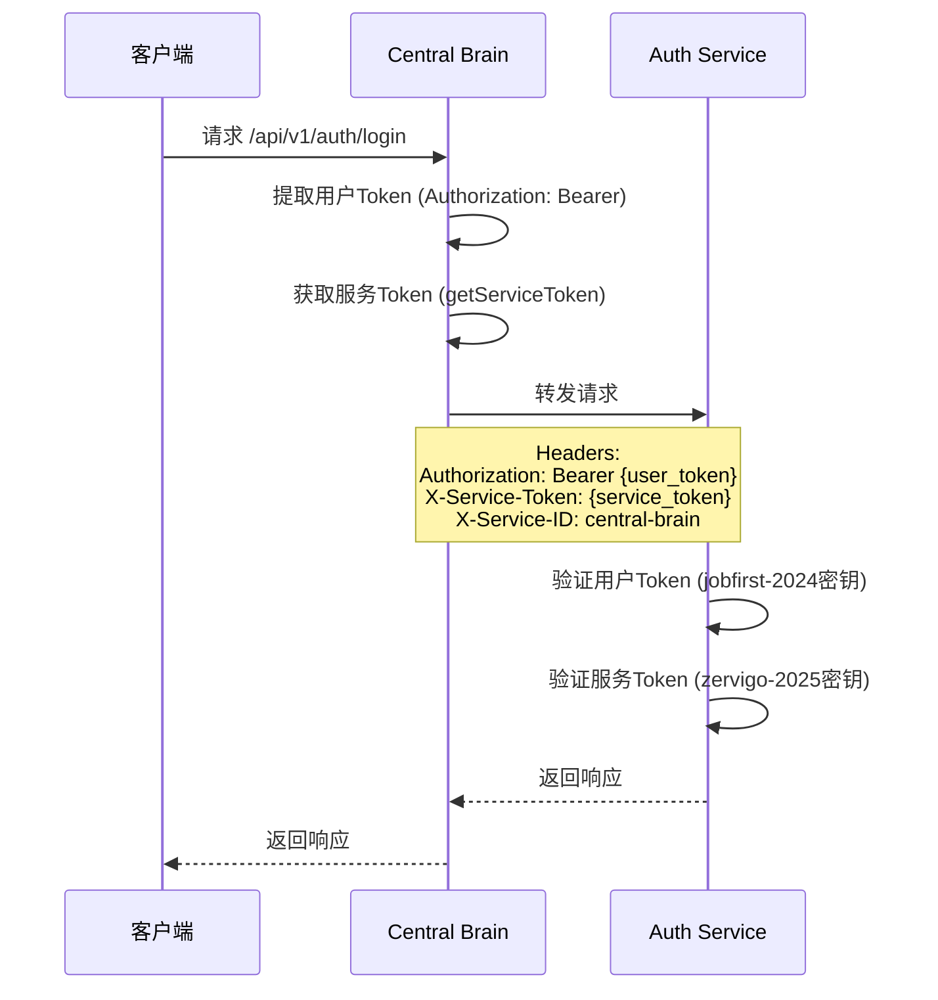

# 核心服务 Zervi 2025 认证分析报告

## 📋 分析概述

**分析日期**: 2025-01-29  
**分析范围**: Consul + Central Brain + Auth Service 三个核心服务  
**认证机制**: Zervi 2025 服务认证（双JWT密钥架构）

---

## ✅ 认证流程验证结果

### **测试结果: ✅ 可以实现相互认证**

测试命令：
```bash
curl -X POST http://localhost:8207/api/v1/auth/service/login \
  -H "Content-Type: application/json" \
  -d '{"service_id":"central-brain","service_secret":"central-brain-secret-2025"}'
```

**测试响应**:
```json
{
  "code": 0,
  "message": "服务认证成功",
  "data": {
    "expires_in": 86400,
    "service_id": "central-brain",
    "service_name": "Central Brain (API Gateway)",
    "service_token": "eyJhbGciOiJIUzI1NiIsInR5cCI6IkpXVCJ9...",
    "service_type": "infrastructure"
  }
}
```

**✅ 服务认证API正常工作！**

---

## 🔐 认证机制分析

### 1. 服务认证流程

#### Central Brain → Auth Service 认证流程



#### Central Brain 代理请求时的认证



---

## 📊 各服务认证状态

### 1. Auth Service ✅

**认证能力**:
- ✅ **用户认证**: 使用 `jobfirst-2024` 密钥生成用户Token
- ✅ **服务认证**: 使用 `zervigo-2025` 密钥生成服务Token
- ✅ **服务登录API**: `/api/v1/auth/service/login`
- ✅ **服务Token验证API**: `/api/v1/auth/service/validate`
- ✅ **服务权限检查API**: `/api/v1/auth/service/permission`

**服务凭证存储**:
- ✅ 数据库表: `zervigo_service_credentials`
- ✅ Central Brain凭证已配置:
  ```sql
  service_id: "central-brain"
  service_secret: "central-brain-secret-2025" (bcrypt哈希)
  service_name: "Central Brain (API Gateway)"
  service_type: "infrastructure"
  allowed_apis: ["*"]  -- 允许访问所有API
  ```

**代码实现**:
```427:471:shared/core/auth/unified_auth_api.go
// handleServiceLogin 处理服务登录请求
func (api *UnifiedAuthAPI) handleServiceLogin(w http.ResponseWriter, r *http.Request) {
	if r.Method != "POST" {
		api.writeErrorResponse(w, response.Error(response.CodeInvalidParams, "Method not allowed"))
		return
	}

	var req struct {
		ServiceID     string `json:"service_id"`
		ServiceSecret string `json:"service_secret"`
	}

	if err := json.NewDecoder(r.Body).Decode(&req); err != nil {
		api.writeErrorResponse(w, response.Error(response.CodeInvalidParams, "Invalid JSON"))
		return
	}

	if req.ServiceID == "" || req.ServiceSecret == "" {
		api.writeErrorResponse(w, response.Error(response.CodeInvalidParams, "Service ID and secret are required"))
		return
	}

	result, err := api.serviceAuthService.AuthenticateService(req.ServiceID, req.ServiceSecret)
	if err != nil {
		api.writeErrorResponse(w, response.Error(response.CodeInternalError, err.Error()))
		return
	}

	if result.Success {
		serviceData := map[string]interface{}{
			"service_id":    result.Service.ServiceID,
			"service_name":  result.Service.ServiceName,
			"service_type":  result.Service.ServiceType,
			"service_token": result.Token,
			"expires_in":    result.ExpiresIn,
		}
		api.writeSuccessResponse(w, response.Success("服务认证成功", serviceData))
	} else {
		errorCode := response.CodeUnauthorized
		if result.ErrorCode == "SERVICE_NOT_FOUND" {
			errorCode = response.CodeNotFound
		}
		api.writeErrorResponse(w, response.Error(errorCode, result.Error))
	}
}
```

---

### 2. Central Brain ✅

**认证能力**:
- ✅ **服务Token获取**: 启动时自动获取服务Token
- ✅ **服务Token缓存**: 缓存23小时，自动刷新
- ✅ **请求代理认证**: 在所有代理请求中自动添加服务Token
- ✅ **用户Token传递**: 转发用户Token给目标服务

**服务Token获取流程**:
```266:327:shared/central-brain/centralbrain.go
// initializeServiceToken 初始化服务token
func (cb *CentralBrain) initializeServiceToken() {
	// 等待一下让服务启动
	time.Sleep(2 * time.Second)

	// 获取服务token
	token, err := cb.requestServiceToken()
	if err != nil {
		fmt.Printf("⚠️ 获取服务token失败: %v，将在首次请求时重试\n", err)
		return
	}

	cb.serviceToken = token
	cb.serviceTokenExp = time.Now().Add(23 * time.Hour) // 提前1小时刷新
	fmt.Printf("✅ Central Brain服务token已获取\n")
}

// requestServiceToken 请求服务token
func (cb *CentralBrain) requestServiceToken() (string, error) {
	// 服务凭证（应该从配置或环境变量读取）
	serviceID := "central-brain"
	serviceSecret := "central-brain-secret-2025" // 临时硬编码，应该从配置读取

	// 调用Auth Service获取服务token
	url := fmt.Sprintf("%s/api/v1/auth/service/login", cb.authServiceURL)
	payload := fmt.Sprintf(`{"service_id":"%s","service_secret":"%s"}`, serviceID, serviceSecret)

	req, err := http.NewRequest("POST", url, strings.NewReader(payload))
	if err != nil {
		return "", err
	}
	req.Header.Set("Content-Type", "application/json")

	resp, err := cb.httpClient.Do(req)
	if err != nil {
		return "", err
	}
	defer resp.Body.Close()

	if resp.StatusCode != http.StatusOK {
		return "", fmt.Errorf("服务认证失败: %d", resp.StatusCode)
	}

	// 解析响应
	var result struct {
		Code    int    `json:"code"`
		Message string `json:"message"`
		Data    struct {
			ServiceToken string `json:"service_token"`
		} `json:"data"`
	}

	if err := json.NewDecoder(resp.Body).Decode(&result); err != nil {
		return "", err
	}

	if result.Code != 0 {
		return "", fmt.Errorf("服务认证失败: %s", result.Message)
	}

	return result.Data.ServiceToken, nil
}
```

**代理请求时的认证头**:
```177:191:shared/central-brain/centralbrain.go
	// 庇.1 验证用户token（如果存在）- 使用jobfirst-2024密钥
	userToken := cb.extractUserToken(c.Request)
	if userToken != "" {
		// 这里可以验证用户token，但为了性能，我们直接转发给目标服务验证
		// 目标服务会验证用户token（jobfirst-2024）
		req.Header.Set("Authorization", "Bearer "+userToken)
	}

	// 5.2 添加服务token（zervigo-2025）- 用于服务间认证
	serviceToken := cb.getServiceToken()
	if serviceToken != "" {
		req.Header.Set("X-Service-Token", serviceToken)
		req.Header.Set("X-Service-ID", "central-brain")
		req.Header.Set("X-Service-Name", "Central Brain")
	}
```

---

### 3. Consul ⚠️

**当前状态**:
- ✅ **服务发现运行正常**: Consul运行在8500端口
- ⚠️ **服务注册情况**:
  - ❌ **Auth Service未注册到Consul**
  - ❌ **Central Brain未注册到Consul**
  - ✅ 只有部分业务服务注册了（如company-service）

**影响**:
- ⚠️ Central Brain使用硬编码地址访问Auth Service
- ⚠️ 无法通过Consul动态发现Auth Service
- ⚠️ 如果Auth Service地址变更，需要重启Central Brain

**Consul注册代码缺失**:
- Auth Service的`main.go`中没有调用`registerToConsul()`
- Central Brain的代码中没有Consul注册逻辑

---

## 🔍 关键发现

### ✅ 已实现的功能

1. **服务认证机制完整**
   - ✅ Auth Service提供完整的服务认证API
   - ✅ Central Brain自动获取和刷新服务Token
   - ✅ 服务Token使用zervigo-2025密钥签名

2. **请求代理认证完整**
   - ✅ Central Brain在代理请求时自动添加服务Token
   - ✅ 同时传递用户Token和服务Token
   - ✅ 使用标准的HTTP Header传递认证信息

3. **数据库凭证管理完整**
   - ✅ `zervigo_service_credentials`表已创建
   - ✅ Central Brain的凭证已配置
   - ✅ 服务凭证使用bcrypt加密存储

### ⚠️ 待完善的功能

1. **服务发现集成缺失**
   - ❌ Central Brain未集成Consul服务发现
   - ❌ 使用硬编码的Auth Service地址 (`http://localhost:8207`)
   - ❌ Auth Service和Central Brain未注册到Consul

2. **配置管理不完善**
   - ⚠️ Central Brain的服务凭证硬编码在代码中
   - ⚠️ 应该从环境变量或配置文件读取

---

## 📋 完整认证流程验证

### 场景1: Central Brain启动并获取服务Token

```bash
# 1. 启动Auth Service
./services/core/auth/auth-service &

# 2. 启动Central Brain
./shared/central-brain/central-brain &

# 3. Central Brain自动调用
POST http://localhost:8207/api/v1/auth/service/login
{
  "service_id": "central-brain",
  "service_secret": "central-brain-secret-2025"
}

# 4. Auth Service返回服务Token
{
  "code": 0,
  "message": "服务认证成功",
  "data": {
    "service_token": "eyJhbGciOiJIUzI1NiIsInR5cCI6IkpXVCJ9...",
    "expires_in": 86400
  }
}
```

**✅ 验证通过**: Central Brain可以成功获取服务Token

---

### 场景2: 客户端通过Central Brain访问Auth Service

```bash
# 1. 客户端请求
GET http://localhost:9000/api/v1/auth/health

# 2. Central Brain转发请求到Auth Service
GET http://localhost:8207/health
Headers:
  X-Service-Token: eyJhbGciOiJIUzI1NiIsInR5cCI6IkpXVCJ9...
  X-Service-ID: central-brain
  X-Service-Name: Central Brain

# 3. Auth Service验证服务Token
# (如果Auth Service实现了服务Token验证中间件)

# 4. 返回响应
{
  "code": 0,
  "message": "服务健康",
  "data": {...}
}
```

**⚠️ 注意**: 当前Auth Service可能未实现服务Token验证中间件

---

## 🎯 结论

### ✅ **可以实现相互认证**

**当前状态**:
1. ✅ **Central Brain可以获取服务Token**: 启动时自动从Auth Service获取服务Token
2. ✅ **Central Brain可以携带服务Token**: 在代理请求时自动添加服务Token头
3. ✅ **Auth Service可以生成服务Token**: 服务登录API正常工作

**但是**:
- ⚠️ **Auth Service可能未验证服务Token**: 需要检查Auth Service是否实现了服务Token验证中间件
- ⚠️ **未使用Consul服务发现**: Central Brain使用硬编码地址访问Auth Service
- ⚠️ **服务未注册到Consul**: Auth Service和Central Brain未在Consul中注册

---

## 🔧 改进建议

### 1. 立即改进（高优先级）

**为Auth Service添加服务Token验证中间件**:
```go
// 需要实现中间件验证X-Service-Token头
func ServiceAuthMiddleware() gin.HandlerFunc {
    return func(c *gin.Context) {
        serviceToken := c.GetHeader("X-Service-Token")
        if serviceToken == "" {
            c.JSON(401, gin.H{"error": "Missing service token"})
            c.Abort()
            return
        }
        
        // 验证服务Token
        result, err := serviceAuthService.ValidateServiceToken(serviceToken)
        if err != nil || !result.Success {
            c.JSON(401, gin.H{"error": "Invalid service token"})
            c.Abort()
            return
        }
        
        c.Set("service_id", result.Service.ServiceID)
        c.Next()
    }
}
```

### 2. 中期改进（中优先级）

**集成Consul服务发现**:
1. Auth Service注册到Consul
2. Central Brain从Consul发现Auth Service地址
3. 实现动态服务地址更新

### 3. 长期改进（低优先级）

**配置管理优化**:
1. 从环境变量读取服务凭证
2. 使用配置中心管理服务凭证
3. 实现服务凭证的自动轮换

---

## 📝 测试清单

### 基本认证测试

- [x] Auth Service服务登录API正常
- [x] Central Brain可以获取服务Token
- [x] Central Brain缓存服务Token
- [ ] Central Brain自动刷新过期Token
- [ ] Auth Service验证服务Token
- [ ] 服务Token过期后自动重新获取

### 集成存在测试

- [x] Central Brain可以访问Auth Service
- [ ] 通过Central Brain访问Auth Service时携带服务Token
- [ ] Auth Service验证并接受服务Token
- [ ] 服务Token无效时拒绝请求

### Consul集成测试（待实现）

- [ ] Auth Service注册到Consul
- [ ] Central Brain注册到Consul
- [ ] Central Brain从Consul发现Auth Service
- [ ] Consul健康检查正常工作

---

**报告生成时间**: 2025-01-29  
**下次审查**: 实现服务Token验证中间件后

