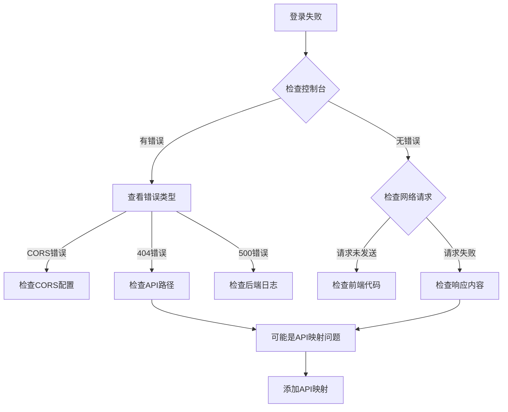

# 登录问题排查指南

## 当前情况

- ✅ 后端服务正常运行（Central Brain + Auth Service）
- ✅ 数据库账号正确（admin / admin123）
- ✅ API 测试成功（curl 测试返回 token）
- ✅ 前端配置正确（API_BASE_URL: http://localhost:9000）
- ❌ 前端登录失败

## 🔍 问题诊断步骤

### 步骤 1: 检查浏览器控制台错误

请打开浏览器的**控制台（Console）**选项卡（不是 Sources 选项卡），查看是否有错误信息：

1. 在开发者工具中，点击 **"控制台"（Console）** 选项卡
2. 查看是否有红色错误信息
3. 特别关注：
   - 网络请求错误（404, 500, CORS 等）
   - JavaScript 错误
   - API 响应错误

### 步骤 2: 检查网络请求

切换到**网络（Network）**选项卡：

1. 点击 **"网络"（Network）** 选项卡
2. 清空所有记录
3. 再次点击"登录"按钮
4. 查找 `/api/v1/auth/login` 或类似的登录请求
5. 检查：
   - **状态码**：应该是 200
   - **请求数据**：确认发送的用户名和密码
   - **响应数据**：查看返回的内容

### 步骤 3: 清除浏览器缓存和 LocalStorage

可能是旧的 token 或数据导致问题：

```javascript
// 在浏览器控制台执行
localStorage.clear()
sessionStorage.clear()
location.reload()
```

### 步骤 4: 查看具体错误信息

在控制台中输入以下命令查看环境配置：

```javascript
// 检查 API 基础 URL
console.log(import.meta.env.VITE_APP_BASE_API)
// 应该输出: http://localhost:9000

// 检查 localStorage
console.log(localStorage)
```

## 🛠️ 常见问题和解决方案

### 问题 1: CORS 跨域错误

**症状**：
```
Access to XMLHttpRequest at 'http://localhost:9000/api/v1/auth/login' from origin 'http://localhost:8081' has been blocked by CORS policy
```

**解决方案**：
检查 Central Brain 是否正确配置了 CORS：

```bash
# 测试 CORS
curl -X OPTIONS http://localhost:9000/api/v1/auth/login \
  -H "Origin: http://localhost:8081" \
  -H "Access-Control-Request-Method: POST" \
  -v
```

### 问题 2: API 映射不存在

**症状**：
```
API 映射不存在: user.login
API 映射不存在: admin.login
```

**原因**：前端使用 VueCMF 的 API 映射机制，需要在数据库中配置

**解决方案**：

```bash
# 检查 API 映射
PGPASSWORD=vuecmf psql -h localhost -U vuecmf -d zervigo_mvp -c "SELECT * FROM vuecmf_api_map WHERE api_path LIKE '%login%';"
```

### 问题 3: 前端使用了错误的登录接口

VueCMF 前端可能使用特定的 API 路径格式。

**检查前端代码**：
```bash
grep -r "login" /Users/szjason72/vuecmf/vuecmf-web-master/src/model 2>/dev/null | head -10
```

### 问题 4: Token 格式问题

**症状**：登录成功但无法访问其他接口

**解决方案**：
```javascript
// 在控制台检查 token
const token = localStorage.getItem('token')
console.log('Token:', token)

// 检查 token 格式（应该是 JWT）
if (token) {
  const parts = token.split('.')
  console.log('Token parts:', parts.length) // 应该是 3
}
```

## 📝 调试命令

### 1. 后端测试登录

```bash
# 测试登录 API（已验证成功）
curl -X POST http://localhost:9000/api/v1/auth/login \
  -H "Content-Type: application/json" \
  -d '{"username":"admin","password":"admin123"}' \
  | jq .
```

### 2. 测试 VueCMF API 映射

```bash
# 测试 API 映射查询
curl -X POST http://localhost:9000/api/v1/mapping/get_api_map \
  -H "Content-Type: application/json" \
  -d '{"table_name":"admin","action_type":"login"}' \
  | jq .
```

### 3. 查看 VueCMF 映射配置

```bash
PGPASSWORD=vuecmf psql -h localhost -U vuecmf -d zervigo_mvp <<EOF
SELECT table_name, action_type, api_path, request_method 
FROM vuecmf_api_map 
WHERE table_name IN ('admin', 'user') 
  AND action_type IN ('login', 'index');
EOF
```

## 🔧 紧急修复方案

如果是 VueCMF API 映射问题，需要添加登录接口映射：

```sql
-- 添加登录 API 映射
INSERT INTO vuecmf_api_map (table_name, action_type, api_path, request_method, note)
VALUES 
    ('admin', 'login', '/api/v1/auth/login', 'POST', '管理员登录'),
    ('user', 'login', '/api/v1/auth/login', 'POST', '用户登录')
ON CONFLICT (table_name, action_type) 
DO UPDATE SET 
    api_path = EXCLUDED.api_path,
    request_method = EXCLUDED.request_method;
```

## 📊 完整诊断流程



## 🎯 下一步操作

1. **打开浏览器控制台的 Console 选项卡**
2. **再次尝试登录**
3. **记录所有错误信息**
4. **告诉我控制台显示的错误**

然后我可以针对具体错误提供解决方案。

## 📞 需要的信息

请提供以下信息：

1. **控制台错误信息**（红色的错误）
2. **网络请求详情**：
   - 请求 URL
   - 请求方法（POST/GET）
   - 状态码（200/404/500 等）
   - 响应内容
3. **是否显示任何提示信息**（成功/失败提示）

---

## 🚀 快速测试

在浏览器控制台执行以下代码，直接测试登录：

```javascript
fetch('http://localhost:9000/api/v1/auth/login', {
  method: 'POST',
  headers: {
    'Content-Type': 'application/json'
  },
  body: JSON.stringify({
    username: 'admin',
    password: 'admin123'
  })
})
.then(res => res.json())
.then(data => {
  console.log('登录结果:', data);
  if (data.code === 0) {
    console.log('✅ 登录成功！');
    console.log('Token:', data.data.accessToken);
  } else {
    console.log('❌ 登录失败:', data.message);
  }
})
.catch(err => {
  console.error('❌ 请求失败:', err);
});
```

这将直接在浏览器中测试登录，绕过前端框架的逻辑。

